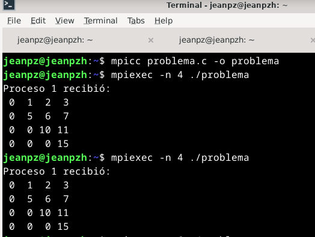

# T04 - Motta Jean Pierre

Este ejercicio consiste en enviar la **parte triangular superior de una matriz cuadrada NxN** usando **tipos derivados en MPI (`MPI_Type_indexed`)**. Se trabaja con dos procesos: el proceso 0 genera y envía los datos, y el proceso 1 los recibe y muestra.

---

## Requisitos Previos

### 1. Instalar OpenMPI en Linux

En sistemas Debian/Ubuntu:
```bash
sudo apt update
sudo apt install openmpi-bin libopenmpi-dev -y
```	
Verifica la instalación:

```bash
mpicc --version
mpirun --version
```

### 2. Elegir un Editor de Código
Puedes usar el editor que prefieras:

- Visual Studio Code (recomendado, con terminal integrada)

- nano (desde terminal):

```bash
nano problema.c
```
- vim, gedit, etc.

### 3. Explicación del Código
El archivo problema.c contiene un programa que:

- Se crea una matriz 1D de tamaño N x N.

- Se usa MPI_Type_indexed para definir la triangular superior (elementos sobre y en la diagonal).

- El proceso 0 inicializa la matriz y la envía usando MPI_Send.

- El proceso 1 recibe los elementos con MPI_Recv y los imprime.

- Ejemplo para N = 4
Matriz original (N = 4):

|  0 |  1 |  2 |  3 |
|----|----|----|----|
|  4 |  5 |  6 |  7 |
|  8 |  9 | 10 | 11 |
| 12 | 13 | 14 | 15 |

Parte triangular superior:

```bash
[0, 1, 2, 3, 5, 6, 7, 9, 10, 11]
```
### 4. Compilación
Compila el archivo .c con el compilador MPI:

```bash
mpicc problema.c -o problema
```
### 5. Ejecución
Ejecuta el programa con 2 procesos:

```bash
mpiexec -n 2 ./problema
```
```bash
mpiexec -n {numero de procesos} ./problema
```
### 6. Resultado : 
